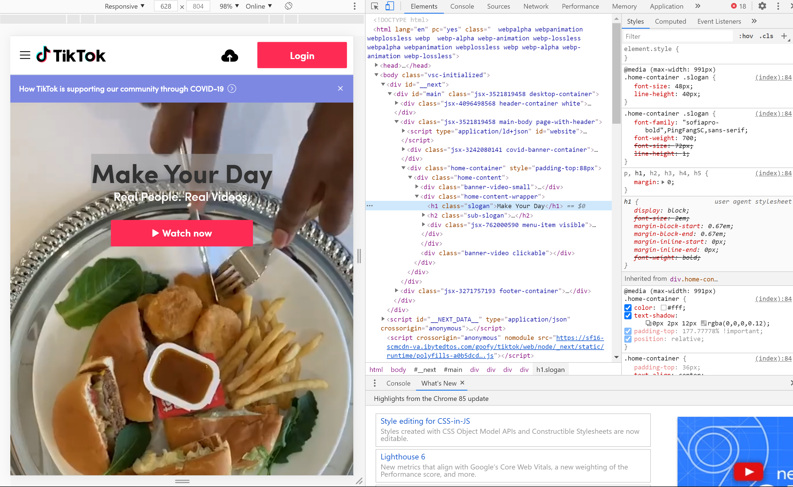
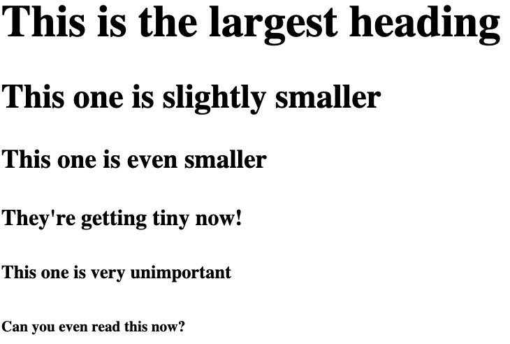
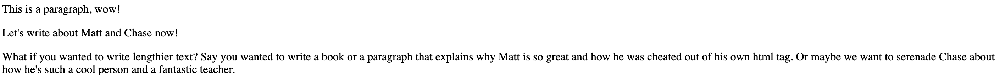
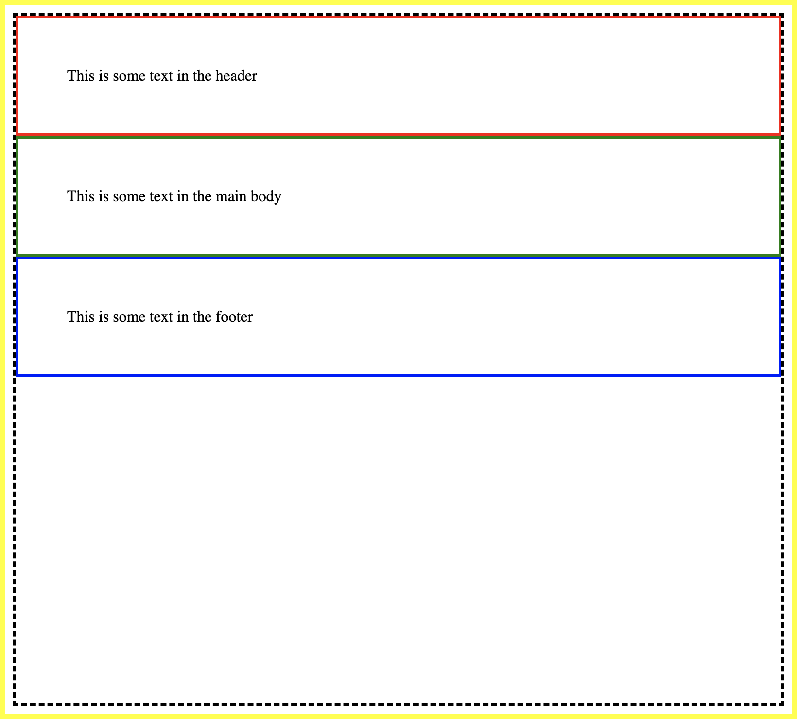

# Lesson 2: Intro to HTML & CSS

In this lesson, we'll take our first look at the building blocks of the web: **HTML** and **CSS**.


## On Hacking TikTok (the Structure of a Webpage)


They were right, as it turns out. If an app with access to all of your personal data can be hacked by a single college student, surely it's too dangerous to be on your phone.

Except there's a trick! We haven't actually hacked TikTok, if you can believe it. If you navigate to tiktok.com yourself, you can see that our "hack" has been reverted. So what did we do?

Let's highlight some text with our cursor, and then right click, and then click **"inspect"**



If you remember from last week, what we're looking at right now is the HTML code for TikTok.com. HTML dictates the layout of the page, essentially what and where our browser displays things.

To replicate our "hack", all we need to do is modify the element that displays "Make your Day" in big black letters.

```<h1 class="slogan">Make Your Day</h1>```

We'll explain how HTML actually works in a bit, but all you need to do is replace *"Make your Day"* with any other text and it should update instantly.

If you mouse around the HTML, you can see the corresponding elements on the page getting highlighted. Clearly there's a lot going on here.

There’s a bar at the top (called a header) and inside that bar, there’s links to other pages. There’s a main part of the page (called a body) and inside of that are some blobs of text, and they’re all formatted differently. There’s a part to the side (called a sider) with some dropdown menus. There's a part toward the bottom (called a footer) with even more links and important information.

As you can probably imagine, this can get super messy and hard to keep track of if we don’t have a simple and easy way to represent this in code.

When you’re coding in HTML, you’re basically **describing** to the computer what you want your webpage to look like. You don’t really care *how* the computer does it, you just need it to give you something that meets your exact specifications.

If your computer spoke english, maybe you’d say something like
‘I need a block at the top that’s 20 pixels high, and then one below that that takes up most of the page, and oh, I need a small section of that block to have a picture of myself. And then at the bottom i want another block that’s ten pixels high’

But your computer doesn't speak english, which makes things harder for us, but it helps in one really big way: using HTML correctly means you’ll get exactly what you want (There’s no ambiguity), which means it’s a super powerful tool. Let’s look at how to actually code…


## What are HTML & CSS?

**HTML** (HyperText Markup Language) is a "markup" language that defines the **structure** of the page. It deals with the **content** of the page (e.g. text, images, videos, lists, tables), and the **relationship** between content (e.g. the order, links to other content, where the header or footer is).

**CSS** (Cascading Style Sheets) is a language that defines the **style** of the page. Style is all sorts of things: the color, shape, and size of content (e.g. text or images); the position and layout of items on a page; animations and effects that draw the user's attention.

We could spend a bit more time talking about the background of HTML & CSS, but, this is a **hands-on** class. So, let's get our hands dirty!


## Hello World: HTML

Create a new file called `page.html` in your editor. The `.html` extension tells the computer that we're writing HTML.

In the file, just put in:

```html
Hello world!
```

Yup, that's it. Just that. If you open this file in your browser (or if you're using an online editor, peek at the output), you should see something like this:


Wow, that was the first line of HTML code that we just wrote! But... it looks just like English, right?

Well, it turns out, HTML is really just a bunch of English that's "marked up" by what we call *tags*. This is not unlike marking up a book to take notes in it.

Let's try our very first tag, `<h1>`.

```html
<h1>Hello world!</h1>
```

You should get something like:


Huh, that looks different! The `<h1>` tag is used to create **headings**, like the title of a page or chapter. `<h1>` is the most important heading that describes all of the content: it is your version of a book title, movie title, etc.

Hm, we've also learned a few things about tags in HTML. We'll use this approach a lot: try something new, and see what we've learned. In this case:

* so far, it looks like a tag has two components: an opening tag, `<___>`, and a closing tag, `</___>`
* inside the `___`, you can put in a name of the tag; we know `h1` is used for title headings
* if we put text *between* the tags, our browser interprets it differently!

We'll refer to these HTML components, consisting of the start tag, content, and closing tag, as HTML *elements*.

But hm, there are still some other things we don't know. Do all tags create different styles? What happens if you put text outside of a tag? Do spaces matter?

Well, the nice thing about our class is that we can just try this out. So, let's do it:

```html
<h1>This is the most important title!</h1>
<h2>If there's an h1, there's probably an h2, right?</h2>
<h3>What about h3?</h3>
<h9000>Or h9000?</h9000>
<matt>I wonder... can I put anything inside the tags?</matt>
```
## Foundational HTML Tags

After playing around with your `page.html` file, you may have noticed that not all words are recognized as tags.

For example `<matt></matt>` is not a valid tag, as much as we want it to be. Why isn't `<matt>` a tag? This isn't right. What kind of secret society gets to decide these things?

Put simply, all the web browsers have decided upon a HTML **standard**. Think of the standard as a rulebook for browsers that says something like:

> We'll support the `<h1>`, `<h2>`, `<h3>`, `<h4>`, `<h5>`, `<h6>` tags, but NOT the `<h7>`, `<h8>`, or `<matt>` tags.

This means we have to learn the foundational tags that the standard outlines. Let's dive into that. (by the way we will be working with html5, which is just a version of HTML that uses a certain standard)

We will start with HTML headings. Let's try out all the heading sizes supported by html5. Try typing the code below into your `page.html` file. (Don't copy paste! It's easier to remember the syntax when you type)

```html
<h1>This is the largest heading</h1>
<h2>This one is slightly smaller</h2>
<h3>This one is even smaller</h3>
<h4>They're getting tiny now!</h4>
<h5>This one is very unimportant</h5>
<h6>Can you even read this now?</h6>
```

You should get something that looks like:



Do you notice anything? The font size gets smaller to indicate that certain text is less important than others. Your eyes are naturally guided towards the largest text first, then the next largest and so on. Neat huh?

This isn't a coincidence: HTML is structured in such a way where information and tags are ranked one above the other according to importance. This is called the `HTML Hierarchy` (Fancy word alert! Remember this, it will come up again later)

### Paragraphs and images

> Checkpoint alert! If you fell behind no worries, just copy the [code found here](checkpoints/01/page.html) into your `page.html`

What if you wanted to write lengthier text? Say you wanted to write a book or a paragraph that explains why Matt is so great and how he was cheated out of his own html tag. Or maybe we want to serenade Chase about how he's such a cool person and a fantastic teacher.

Let's add the following code to our `page.html` file

```html
<p>This is a paragraph, wow!</p>
<p>Let's write about Matt and Chase now.</p>
<p>What if you wanted to write lengthier text? Say you wanted to write a book or a paragraph that explains why Matt is so great and how he was cheated out of his own html tag. Or maybe we want to serenade Chase about how he's such a cool person and a fantastic teacher.</p>
```

This should result in something like:


Note how the paragraphs naturally have line breaks between them, even though we don't have any in our code. This is a great example of how HTML is _telling_ the browser how to display your information.

---

Let's add more content. What if we want an image? Here's an image of the [matt](https://avatars0.githubusercontent.com/u/14893287?s=400&u=7a0d69cf5f16e415439c20017f85f9c8dc4582d1&v=4)!

Let's add the following code into our `page.html` file. It's okay to copy and paste here, since the link is so long
```html

```
You should now have a picture of matt on your webpage.

### Links (or more formally known as Anchors)
> Checkpoint alert! If you fell behind no worries, just copy the [code found here](checkpoints/02/page.html) into your `page.

What if we wanted to add a hyperlink to our webpage? Maybe a link to the [ACM TeachLA website](https://teachla.uclaacm.com/)?

We can do this with the `<a>` tag. Let's add it to our `page.html`
```html
<a href="https://teachla.uclaacm.com/">A link to the ACM TeachLA website!</a>
```

You should now have that familiar blue underlined text we all know as links!


But wait, why do the HTML tags for `` and `<a>` have things inside of the tags? What are `href` and `src`?

These are known as HTML **attributes**, which you can think of little nametags you add to HTML tags. For example the `href` and `src` attributes tell their html tags where to look to find the webpage or image respectively. In english `<a href="https://teachla.uclaacm.com/">` would roughly translate to "put a link that points to the teachLA website". 

We'll cover more about attributes later today.

### Explicit HTML structure
> Checkpoint alert! If you fell behind no worries, just copy the [code found here](checkpoints/03/page.html) into your `page.

Remember when we talked about the HTML hierarchy? Let's bring that back again.

There are some special tags in HTML, ones that delinate specific sections of a webpage. You don't need to copy any of this down in `page.html` but it's usefuly just to follow along with the images below.

```html
<html>
  <body>
    <header>
      This is some text in the header
    </header>
    This is some text in the main body
    <footer>
      This is some text in the footer
    </footer>
  </body>
</html>
```
In the html hierarchy, the `<html>` tag tells the browser: "Hey the webpage begins here! Everything surrounded by the `<html>` tags is part of the webpage"

The `<body>` tag tells the browser where to loook for the main content. Everything that the user will end up seeing should be in the `body` tag.

`<header>` and `<footer>` indicate exactly what the words imply: a header at the top of a webpage and a footer at the bottom.

Let's see what this hierarchy looks like visually:


Here you can see the header surrounded by a red border, the main text surrounded by a green border and the footer surrounded by a blue border. The body has a dashed black border, and the html has a solid yellow border

## Styling

Now that we’ve defined the content and structure of our webpage with HTML, it’s time to specify how that content looks, also known as the *style* -- for example, we might want to change the size, color, and position of elements on our page. This is where CSS comes in! 

Before we dive right into it, we need to consider how we can use CSS with HTML. For starters, do we need to write our CSS in a separate file from our HTML code? The answer depends, as it turns out there’s actually several ways to use CSS with HTML. Let’s take a look at a couple of the most useful ways:

* Inline CSS
  * This is a way to write CSS directly into your HTML file, using the `style` attribute of HTML elements (more on this in a second!)
* External CSS
  * This involves writing CSS in a separate file. In practice, this is the most common and efficient way to use CSS with HTML. We’ll cover this method of using CSS later in the lesson!

Don’t worry about the names or specifics of these methods -- we just need a high level overview so that we can get right to using CSS. And if you’re wondering which method is “better,” as we’ll see, each method has its pros and cons! We’re going to start with the inline method, since this is the easiest way to demonstrate and get started with CSS.

As previously mentioned, the first step to adding inline CSS is to add the `style` attribute to the HTML element we want to customize. The value of the attribute is the particular CSS style(s) we want to apply. Here’s how this looks with HTML, minus the actual CSS: 

```html
<tagname style="some CSS!">text</tagname>
```

CSS allows us to specify styles using certain **properties** and **values**. The property is the type of style we want to change (e.g. color, size), and its value is the exact style we want (e.g. color can be red). The CSS syntax is fairly straightforward: 

```css
property:value;
```

Combining this with our HTML, we have:

```html
<tagname style="property:value;">text</tagname>
```

Not too bad so far! As you might imagine, [the list of properties we can use](https://www.w3schools.com/cssref/) is huge. In addition, each property only accepts certain values, though most tend to be pretty intuitive. Here’s a quick rundown of a few essential CSS properties and some values they accept -- but if you’d rather see CSS in action and check out the specifics later, feel free to skip straight to the demonstration!

* color
  * Specifies the color of the *text* of an element
  * Value can be a color keyword (e.g. `red`, `blue`, `orange`, and who could forget `papayawhip` and `lemonchiffon`) or hex code, RGB, and HSL (if you’re unfamiliar with these, don’t worry about it yet!)
* background-color
  * Specifies the color of the *background* of an element
  * Value can be same as those for `color`
* font-size
  * Specifies the font size of text
  * Value can be a keyword (e.g. `large`) or a number followed by one of various units. The most common of these is pixels, written as `px`
* font-weight
  * Specifies the degree of boldness of text
  * Value can be a certain number or keyword (e.g. `bold`, `lighter`)
* text-align
  * Specifies the horizontal alignment of text
  * Value can be a keyword (e.g. `left`, `right`, `center`)

Now that we’ve got all that out of the way, we can start actually writing some CSS! Let’s start with a heading and change its color to blue:

```html
<h1 style="color:blue;">a blue heading!</h1>
```

Let's see what else we can do!

```html
<a style="background-color:blanchedalmond;" href="https://teachla.uclaacm.com/">a fancy link</a>
<p style="font-size:75px;">biiig text</p>
<p style="font-weight:bold;">i'm feeling bold today</p>
<footer style="text-align:center;color:green;">this footer is centered and green!</footer>
```

Before we move on, there's one thing we need to note -- you may have noticed that certain HTML elements appear to already have their own styles. For example, text included in an `h1` tag is bigger and bolder than text in a `p` tag, even though we haven't specified those styles with CSS. This is because some elements have default CSS styles, which are often convenient -- typically, we'd like the heading to be big and bold. However, the styling differences between different tags are still the result of CSS, not HTML. Remember, styling is always done with CSS, not HTML -- if you want big and bold text that isn't intended to serve as a heading, you should use CSS and a more appropriate tag than `h1`. 

## Classes and CSS

Okay, so now we know how to style elements with inline styling. But what if we wanted to use the same style for multiple elements - we don't want to repeat ourselves many times!

Turns out, computer programs are just as lazy are you, and hate repeating themselves. To solve this problem, they came up with a way to define reusable styles with CSS: using **CSS classes**. We can think of a class as a group of elements that we want to apply the same styles to. To include an element in a class, we use another HTML attribute, the `class` attribute, and specify the name of the class as the value. For example, to put a `p` element in a class called `group`, we would write

```html
<p class="group"></p>
```

### Setting up a "Stylesheet"

*Note: if you're using repl.it or codepen, you can skip this step!*

Before we do any legwork, we need to do a tiny bit of setup. We already have a `page.html`; but, we also need to create a `page.css` file. This file will contain ALL of our CSS - it is appropriately called a stylesheet.

Then, closer to the top of the `page.html`, we need to add in a `link` tag:

```html
<link rel="stylesheet" href="page.css">
```

And, that's it! From now on, where you see CSS, plop that into `page.css`; for HTML, put it in `page.html`.

### CSS Basics

Let's take a look at a very simple CSS declaration:

```css
.red-text {
  color: red;
}
```

```html
<p class="red-text">this text will be red!</p>
<p class="red-text">so will this!</p>
```

This is a *CSS class declaration*; you might guess that it makes text red, and you'd be right!

There are a few things we should break down on how exactly this works. Don't stress about the names - the concepts or what matters!

1. The `.red-text` is called the *selector*, and it says what the style applies to. In this case, it applies to anything that we name `red-text` - which we did with `class`
2. Then, there are a few things in between our braces, `{` and `}` - these are the styles that will be applied!
3. Each line of CSS within the braces is of the form `PROPERTY:VALUE;`; this is what we've seen before. As a reminder:
    * the property is the `color`
    * then, we have a `:` - this is mandatory
    * then, we have the value, in this case, `red`
    * finally, we have the semicolon, `;`

This takes a lot of time to get used to, so don't overstress about it! The best way to get better with this is with practice.

Let's add on to our example:

```css
.large-red-text {
  color: red;
  font-size: 30px;
}
```

```html
<p class="large-red-text">this text will be large and red!</p>
<p class="large-red-text">and this text too! wow!</p>
```

Wow, that's convenient! We can now apply many different complex styles to different HTML elements!

We can have multiple classes, and apply them to different elements:

```css
.red-text {
  color: red;
}
.blue-text {
  color: blue;
}
.large-text {
  font-size: 30px;
}
```

```html
<p class="blue-text">this text will be blue!</p>
<p class="blue-text large-text">this text will be large and blue!</p>
```

## Conclusion

...
