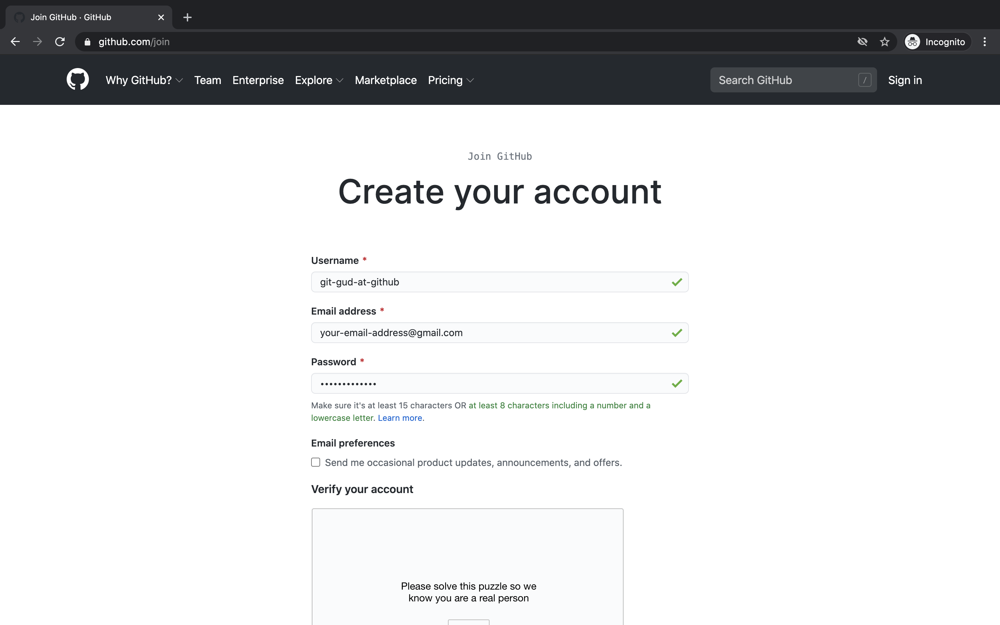
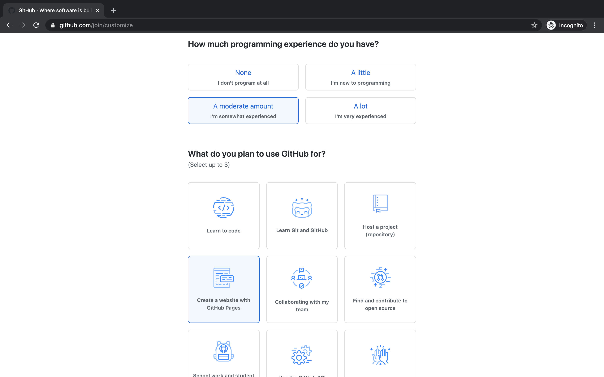

# First Steps w/ GitHub

- [What is GitHub? Why are we using it?](#what-is-github-why-are-we-using-it)
- [Creating a GitHub Account](#creating-a-github-account)
- [Creating a GitHub Repository](#creating-a-github-repository)

* [Starting A Repository From Scratch](#starting-a-repository-from-scratch)

  - [Git Init](#git-init)
  - [Saving Your Changes](#saving-your-changes)
  - [Git Status](#git-status)
  - [Git Pull](#git-pull)
  - [Staging Changes And Git Add](#staging-changes-and-git-add)
  - [Git Commit](#git-commit)
  - [Git Branch](#git-branch)
  - [Git Remote](#git-remote)
  - [Git Push](#git-push)
  - [Git Stash](#git-stash)

* [Main Git Workflows](#main-git-workflows)

- [Enabling GitHub Pages!](#enabling-github-pages)

- [Conclusion](#conclusion)

## What is GitHub? Why are we using it?

Github is many things. Let's write out some of the different things that describe it. In doing so we'll get a clearer understanding of why it's so useful from a software viewpoint.

**Github is a place to store files.**

Specifically Github is often used to store files with code in them. Think `.js`, `.html`, and `.css` files, all things you've worked with before!
But if that's all Github does, why don't we just opt for another platform to store our files? Why can't we just upload all our code files to Google Drive?

**Github/git offers version control**

Good question! Github is very similar to Google Drive, but it has the added benefit of tracking history. Think of uploading a a photo to Google Drive, you'll know who modified the image and at what time. With code, however, we need our history to be more _granular_. It's not enough to know when a file changed, programmers want to know when specific lines change and who changed those lines (think of how easy it was to break your html by just omitting a closing bracket).

This detail also allows programmers to create a rich history about the creation of their code: if Evan updates lines 3 through 10 on a carrot-cake.js on Matt's birthday at 10:00 a.m. Pacific Time, a programmer 20 years down the line can see that specific update Evan wrote. We call this creation of history through small updates (or _commits_ in Github jargon) version control.

**Github is a place to collaborate**

With Github's rich history it is easy for multiple programmers to collaborate on a single project at the same time. Think of a Google Doc, where multiple people can work on writing a different parts of a report at the same time. Github lets programmers do a very similar thing, but it's even more powerful.

Evan and Matt can be working on different parts of a `.js` file at the same time (much like our Google Doc example) but Evan could we working on a _different version_ than Matt. If you want, you can think of these different versions as parallel timelines in separate (alternate) universes. Does this mean Github lets us be time travelers?! Sort of.

Evan can work on a certain feature in his timeline (such as cleaning up a bug he made in a previous commit), while Matt works on a different feature (like creating a cool new online code editor). When they're both done, they can combine those two parallel timelines together back into our current timeline (more jargon here that you can ignore if you just want the bigger picture: in Git we usually call parallel timelines _branches_, and the combination of parallel timelines _merges_).

Can you see what makes this so powerful? When our Github grows large and includes hundreds of files, Evan and Matt's separate timelines allow them to work independently where one person's changes won't affect the other's work. (This is where Github differs from Google Docs: ever have someone edit the same word you were trying to fix at the same time? This won't happen in separate Git branches).

Let's review what Github is and why programmers love it so much. Github is a great place to store files on the internet, creating a backup for our code. More importantly, Github let's us track a rich history of the development of code and this history is valuable for other programmers. Lastly Github lets us become time travelers and work with other people!

## Creating a GitHub Account

To create a Github account you'll need an email address you can log in to, a secure password you'll remember and a creative username!


Once you've created an account select the options that best describe you in the welcome flow



Github will prompt you to confirm your email, which you should do now.

## Starting A Repository From Scratch

On GitHub, you can create a new repository from scratch by following the instructions that they list out when you click `New Repository`.

```
echo "# testing" >> README.md
git init
git add README.md
git commit -m "first commit"
git branch -M main
git remote add origin git@github.com:YOUR_USERNAME/YOUR_REPOSITORY.git
git push -u origin main
```

Let's break down what exactly is happening!

### Git Init

```
git init
```

When you run git init, you initialize a git repository in the directory of your choice.

By running

```sh
$ ls -a`
```

you can see a `.git` directory now inside your project, which is where all the version control that comes with git is contained.

Even though we've made a git repository with `git init`, we still can't see our website or code online anywhere yet.

### Saving Your Changes

The reason why your changes haven't shown up yet is because all of the changes that you have made have only been on your "local machine" (the computer you're coding on!) and it's not linked to a repository that's stored online yet, (called a remote repository).

### Git Status

To view the status of your local repository, you can run

```sh
$ git status
```

### Git Pull

to see how your local repository compares to the remote (or nothing if it's not linked to any yet!).

If you you're working on a repository that already exists and you think that there are some new changes from when you last worked on it, you can run the

```sh
git pull
```

command to bring your repository up to date with the most recent changes if other people have been working on it at the same time. (we'll get into how to work on repositories with other people in the future!)

```sh
$ git status
On branch main
No commits yet.

Untracked files:
  (use "git add <file>..." to include in what will be committed)
        index.html
        hello.md
```

### Staging Changes And Git Add

Like it says, our files are not staged for changes yet. When we think that we are done with the changes we want to make and have our files tracked by git's version control system, we can run the

```sh
$ git add FILE_NAME_1 FILE_NAME_2
```

to tell git that we want to move these changes to the "staging area" and mark these files as marked for change. If at any time you realize that you didn't want to add a particular file, you can run

```sh
$ git reset HEAD -- path/to/file
```

which tells git that you want the file to look like the previous commit on the current branch you are on as opposed to the version of the file you just edited.

### Git Commit

To add your staged changes to version control and have Git **actually** track those changes, you have to run the [commit](https://www.atlassian.com/git/tutorials/saving-changes/git-commit) command

```sh
$ git commit
```

which will take a snapshot of your local repository and save it inside the repository.

Git commit actually opens a text editor asking you for a commit message, where you put a brief description of what you are doing on the first line, separated by an empty line, and a more detailed description of what you did below, but you can just put a quick summary and combine it together by running

```sh
$ git commit -m "your short commit message"
```

to do it all on the command line without opening a text editor.

### Git Branch

```sh
git branch -M main
```

Git's version control is stored like a tree. By running git branch -M main , we're telling Git that we want to make the current state of the repository the "main" branch of the tree, and everything will lead back up to the main branch as the "default branch."

### Git Remote

Even after doing this, your changes still won't show up online! That is because even though we have our git repository set up on our machine, it's not "linked" to a repository existing online yet. To link it online so that other people can see it, you can run the `git remote add origin` command to tell Git that you want to link your repository on your laptop to one on github, stored underneath your username.

```sh
git remote add origin git@github.com:YOUR_USERNAME/YOUR_REPOSITORY.git
```

### Git Push

Finally, to have changes on your local repository pushed to the remote repository, you have to run the [git push](https://git-scm.com/docs/git-push) command.

By running

```sh
$ git push
```

NOTE: If it tells you to set upstream origin, that means that whenever you push, Github will compare the changes on whatever you're working on now, or what you just committed, to the "origin" of the .git repository that you initially made or cloned from.

you can have all your changes shown up online to the remote repository and it is now there for the world to see!

### Git Stash

If you have changes on your branch and it tells you that you need to store local changes before switching or if you want to store the state of your local repository without putting it online for any reason, you can use

```sh
$ git stash
```

to save the state of your repository with your local changes,
and

```sh
$ git stash apply
```

to recover them later!

## Main Git Workflows

Alright! Now whenever you want to make changes in the future to your project, you just have to run these commands in this order to save your changes both locally and on the remote.

```sh
git status                           # to check your repository status, check if you are in a repo
git pull                             # to get the most up to date code
git add FILE_1 FILE_2 ...            # to stage your files to be committed
git commit -m "DESCRIPTION_HERE"     # to commit your files to git
git push                             # to push your changes to the remote
```

## Hosting on Github Pages

To make your website available to the public, you can go to the settings menu and go to the pages section to generate a URL for people to go to the website you just made!

You can view an example of a site hosted on github pages [here](https://matthewcn56.github.io/teachla-owo/), at https://matthewcn56.github.io/teachla-owo/ and the repository linked to it [here](https://github.com/matthewcn56/teachla-owo) at https://github.com/matthewcn56/teachla-owo .

What's really cool with this is that every time that you **push** to your main branch, your website gets updated automatically with the newest updates.

**NOTE:** Your HTML files can be called anything, but in the case of github pages, the main page of the website you created **must** be called index.html for it to be displayed when someone visits your url!

## Enabling Github Pages

To make your website available to the public, you can go to the settings menu and go to the pages section to generate a URL for people to go to the website you just made!

You can view an example of a site hosted on github pages [here](https://matthewcn56.github.io/teachla-owo/), at https://matthewcn56.github.io/teachla-owo/ and the repository linked to it [here](https://github.com/matthewcn56/teachla-owo) at https://github.com/matthewcn56/teachla-owo .

What's really cool with this is that every time that you **push** to your main branch, your website gets updated automatically with the newest updates.

**NOTE:** Your HTML files can be called anything, but in the case of github pages, the main page of the website you created **must** be called index.html for it to be displayed when someone visits your url!

## Conclusion

We learned quite a lot of useful stuff in this lesson:

- What GitHub is
- Why is GitHub so useful and how it can facilitate collaboration
- How to use GitHub to host your website on the internet for anyone to see

This might all seem new and daunting at first but I am sure you'll get pretty good at it once you start using it frequently. Next week, we are going to jump into learning JavaScript and how you can use it to make your website much more interactive.
