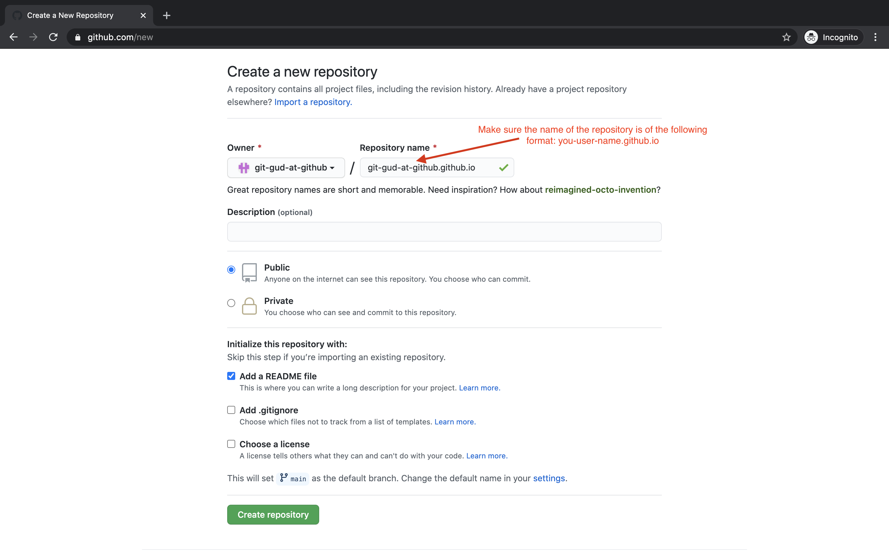

# First Steps w/ GitHub

* [What is GitHub? Why are we using it?](#what-is-github-why-are-we-using-it)
* [Creating a GitHub Account](#creating-a-github-account)
* [Creating a GitHub Repository](#creating-a-github-repository)
* [Committing and Uploading Files](#committing-and-uploading-files)
* [Enabling GitHub Pages!](#enabling-github-pages)
* [Conclusion](#conclusion)

## What is GitHub? Why are we using it?
Github is many things. Let's write out some of the different things that describe it. In doing so we'll get a clearer understanding of why it's so useful from a software viewpoint.

**Github is a place to store files.**

Specifically Github is often used to store files with code in them. Think `.js`, `.html`, and `.css` files, all things you've worked with before!
But if that's all Github does, why don't we just opt for another platform to store our files? Why can't we just upload all our code files to Google Drive?

**Github/git offers version control**

Good question! Github is very similar to Google Drive, but it has the added benefit of tracking history. Think of uploading a a photo to Google Drive, you'll know who modified the image and at what time. With code, however, we need our history to be more *granular*. It's not enough to know when a file changed, programmers want to know when specific lines change and who changed those lines (think of how easy it was to break your html by just omitting a closing bracket). 

This detail also allows programmers to create a rich history about the creation of their code: if Evan updates lines 3 through 10 on a carrot-cake.js on Matt's birthday at 10:00 a.m. Pacific Time, a programmer 20 years down the line can see that specific update Evan wrote. We call this creation of history through small updates (or *commits* in Github jargon) version control.

**Github is a place to collaborate**

With Github's rich history it is easy for multiple programmers to collaborate on a single project at the same time. Think of a Google Doc, where multiple people can work on writing a different parts of a report at the same time. Github lets programmers do a very similar thing, but it's even more powerful.

Evan and Matt can be working on different parts of a `.js` file at the same time (much like our Google Doc example) but Evan could we working on a *different version* than Matt. If you want, you can think of these different versions as parallel timelines in separate (alternate) universes. Does this mean Github lets us be time travelers?! Sort of. 

Evan can work on a certain feature in his timeline (such as cleaning up a bug he made in a previous commit), while Matt works on a different feature (like creating a cool new online code editor). When they're both done, they can combine those two parallel timelines together back into our current timeline (more jargon here that you can ignore if you just want the bigger picture: in Git we usually call parallel timelines *branches*, and the combination of parallel timelines *merges*).

Can you see what makes this so powerful? When our Github grows large and includes hundreds of files, Evan and Matt's separate timelines allow them to work independently where one person's changes won't affect the other's work. (This is where Github differs from Google Docs: ever have someone edit the same word you were trying to fix at the same time? This won't happen in separate Git branches).

Let's review what Github is and why programmers love it so much. Github is a great place to store files on the internet, creating a backup for our code. More importantly, Github let's us track a rich history of the development of code and this history is valuable for other programmers. Lastly Github lets us become time travelers and work with other people!

## Creating a GitHub Account
To create a Github account you'll need an email address you can log in to, a secure password you'll remember and a creative username!

Once you've created an account select the options that best describe you in the welcome flow

Github will prompt you to confirm your email, which you should do now.

## Creating a GitHub Repository
We now need to create a *Repository*. Think of a repository as analogous to a Google Drive folder, but with the added benefit of version control like we said before. Put simply, Github will track the history of your files, which includes information about who updated which files at what time, and what content they added or deleted.

Let's make a repository. Click on the `Create a repository` button on the left-hand side

This part is important: name your new repository `YOUR_USER_NAME.github.io`
This special name signals to Github that you plan to use this repository to host your account's Github pages, which we'll talk about later.

We now have to fiddle around with the settings a bit to enable Github pages.
Navigate to the settings tab from your homepage:

Find the section titled: `Github Pages`. In the dropdown menu in that section, select the `main` option

Wait a few minutes then navigate to `https://YOUR_USER_NAME.github.io`. (For example, mine would be: https://git-gud-at-github.github.io/index.html)
You'll be able to see your own webpage live on the internet! Any computer can navigate to your specific url and find your website.

## Committing and Uploading Files

Now that we have created a repository, let's upload some files to it. We first need to download our code files from repl.it. Simply go to [repl.it](repl.it) and navigate to the project that you have been working on. Save the zip folder in any directory you want.

**Note:** We just downloaded a zip folder from repl.it which needs to be unzipped before uploading to Github. In ChromeOS, this process usually just involves copying the files from the downloaded folder to any other folder you want.

After your files have been dowloaded and unzipped, we'll need to upload them to GitHub. Navigate to your github repo and click on the add files button.

Either drag and drop your files in the box provided or click the button to navigate your file system and find and upload your files.

Now, make sure you select all the files from your zip folder. Your interface may look different than mine but you should have all 3 files selected. Click open to upload them to github.

After your files have been successfully uploaded, we need to commit (or save them).

**Note:** You may not see some files since they might be empty so don't worry, that is not an error. It is just because Github does not allow you to upload empty files. However, make sure you see AT LEAST the index.html file as in the picture below.

## Enabling GitHub Pages!

Since we already have named our repository as *YOUR_USER_NAME.github.io*, GitHub Pages is automatically turned on. Now, to make sure everything is been done properly, navigate to `https://YOUR_USER_NAME.github.io`. If you don't see any updates, wait for a few minutes and try again.

## Conclusion

We learned quite a lot of useful stuff in this lesson:

* What GitHub is
* Why is GitHub so useful and how it can facilitate collaboration
* How to use GitHub to host your website on the internet for anyone to see

This might all seem new and daunting at first but I am sure you'll get pretty good at it once you start using it frequently. Next week, we are going to jump into learning JavaScript and how you can use it to make your website much more interactive.