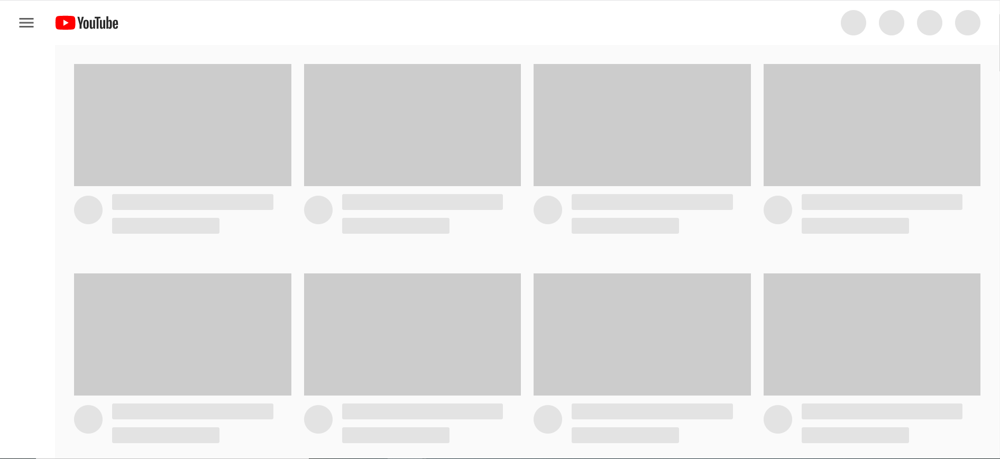

## Making our Webpages Interactive! 

In this lesson, we are going to take a look at JavaScript, a scripting language used in just about every website on the internet! It’s what enables a programmer to add extra functionality to their web page that can’t be easily done using HTML or CSS, which we talked about in previous weeks. JavaScript’s main purpose is to allow dynamic interaction between the user of a website and the website itself. So, with HTML and CSS, we can have static (not changing) web pages, but JavaScript allows us to have features that will change based on some input that the user gives, like a button click or typing on the keyboard. 

So, you’re probably wondering exactly what JavaScript can do, and that’s a great question! Some examples are that JavaScript could allow you to add buttons that make something happen on a web page, like show a picture of a unicorn or show a new sentence on the page. It could allow you to embed a certain video from Youtube or content from another website onto your own web page. We will hear of even more examples today of what JavaScript can do for our web applications, and you will even get a chance to use it and see how it works. 

Let's take a quick look at what happens when we disable JavaScript and view a website that uses it! If we head over to YouTube and disable JavaScript on our browser, here's what the site looks like:


The site is barely recognizable! Clearly, JavaScript enables a lot of functionality in modern web sites.

The next question is: how different is JavaScript from HTML, CSS, or other programming languages? Basically, JavaScript isn’t too much different from other programming languages you’ve heard of or maybe used, but is just used for a different purpose a lot of the time. Just like the most popular programming languages (like Python or Java or C), JavaScript has variables and functions. This is what we will talk about next. 

To make a website interactive, we need a way to deal with information, or data. For example, let’s say we want to make a feature on our web page where the user types in a message, and the web page displays an encoded version of the message. We’ll need a way to store the message that the user typed so that we can encode it. Put simply, we need a way to store information so that we can do stuff with it. In computer programming, we store information using a **variable**. You can think of a variable as a container that can store any sort of information. For example, if we wanted to store someone’s name, we could have a `name` variable that contains the value “Bob”. If we wanted to store someone’s age, we could have an `age` variable that contains the value 25. Here’s how we would create these variables in JavaScript:

```
var name = “Bob”
var age = 25
```

The `var` keyword indicates that we’re creating a variable, and the equals sign is used to give the variable a value to store. In English, we could read the second line as `create a variable called age and give it the value 25`.

Now, any time we use the variable `age` in our program, we’ll really be using the value that it contains, 25. For example, on Bob’s birthday, he’ll be one year older, so we’ll need to increase his age by 1. We can do so like this:

```
age = age + 1
```

In English, this means `Add 1 to the value stored in age, and store the result in age`. So, `age` will hold the value 26. Since `age` contains the value 25, this is essentially the same as

```
age = 25 + 1
```

Another thing that will come in handy down the line is being able to tell the computer exactly what to do once, and asking it to perform that task again without telling it every step again. For example, let’s say I want to program a robot to make me some brownies. I will have to give it the recipe, or the series of instructions it needs to perform to make the brownies:

```
Add 2 eggs
Add 3 cups of chocolate
Mix ingredients in a bowl
…
```

The next time I want brownies, I don’t want to dictate the recipe to the robot again. I’d rather tell it something along the lines of “yo make me some brownies,” and have the robot perform those same steps again. 

In programming, we can do this using something called a **function**. A function is just a block of code that performs some action. For this example, the function could be called `brownies`, and the code would be the recipe. 

Here’s what a function looks like in JavaScript:

```
function myFunction() {
  some code!
}
```

where “some code!” is replaced with JavaScript code. If we wanted the computer to run “some code” multiple times throughout our program, instead of writing the code again and again, we could instead write `myFunction()`. The computer would then know to run the code contained in `myFunction`.
  
At this point, you're probably asking "Well, how do I actually harness the power of Javascript to make interactive websites and apps?", and for that, you've come to the right place!  

There are two main ways to incorporate javascript into your HTML file, and they both involve the \<script> tag.  
(The \<script> tag is simply a way to let the browser know that whatever is inside should be **interpreted as JavaScript code**) 

1. You can link an external .js file by specifying the *src* (source) *attribute*  
```<script src="script.js"> </>```  
This way is great when you have a lot of code, because it lets you keep your HTML file neat and easy to read. 
2. You can write your JavaScript **inside** of your script tag
``` <script> var i = 0... </>```  
This way is good if you have a small amount of code, and we'll be using it for its simplicity. 

Now that we know how to incorporate JavaScript in our HTML, we need a way to allow *input* from the user of our website.  
  
At its most basic level, we define *input* as any information, or message,  we get from our user. Our goal is to take in that input, and send back a relevant *output*, or message, back to our user.  

One really easy way to get input from our user is with the *onclick* attribute. As you might have guessed, the *onclick* attribute defines what should happen when an element is clicked!  

Let's define a paragraph tag as:  
```<p onclick="">Click me!</p>```  
But what actually goes in those ""? We need a **repeatable task, or way of doing something**, or in other words, a **function!**  

So let's go back to our \<script> tag, and write some javascript to define a **function** that tracks how many times we've clicked our element. 

```var click = 0;```

In english, this means 
```define a variable called click, and start it at zero```  

Next, we have

```function buttonClick() {}```

Which means 

```Define a function called buttonClick. Anything inside of the curly braces is what it does.```

Inside of the curly braces:  
 
``` function buttonClick(){ click = click + 1; }```

Which means  

```Every time you buttonClick, the variable click is whatever it used to be plus 1, or in other words, just adding 1 to click```  

We have one last line, and this is the one that actually changes our HTML:  

``` function buttonClick(){ click = click + 1;    document.getElementById('num').innerHTML = click;}```

Ok, that's a lot.  
The first part of that line ```document.getElementByID('num')``` means that we're asking to find some element in our HTML that has the ID 'num'. But what is an ID?  

An ID is another HTML attribute that let's us identify unique elements. Much like a student ID, where one student gets one ID, one element gets one ID.  
This lets us give the page an ID and the page will always respond *"Oh, I know exactly which element you're talking about, here it is"*  

The next part of the line ```.innerHTML = click;``` 
The *innerHTML* specifies what goes inside of the element's tags! In this case, we're setting it equal to the number of times we've clicked our \<p> tag.  
*Note that this is not an HTML attribute, it is javascript*  

All together, this line is saying:  
```Get the element whose ID is 'num', and make the stuff inside of its tags equal to the number of times we've clicked our button element```

All we need to do now is make a new element, with the ID 'num', to display how many times we've clicked our button element. 

```<p id="num>0</p>```
