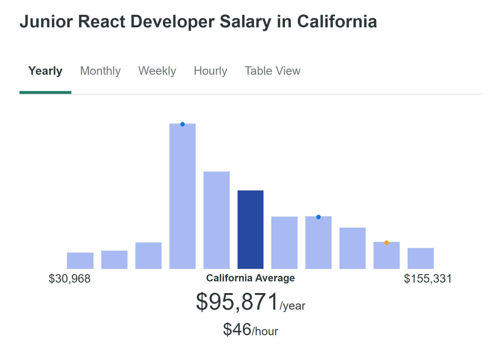
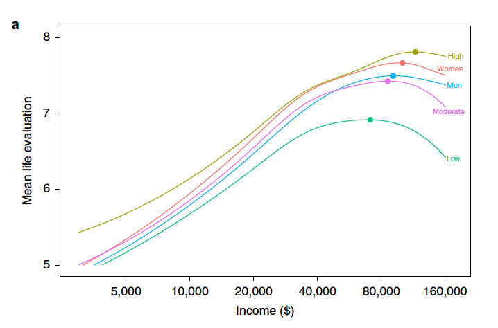

# Why learn React? 



*We're kidding (mostly)* 

Believe it or not, that's actually our *least important* reason to learn react.  
After all, fat stacks of cash don't make working with broken technologies any more fufilling.  



No, the reason we decided spend all this time writing this curriculum and teaching it is because React is so powerful and easy to use that we believe that it's accessible enough that people will go from saying:  
 **"I want to be an engineer because it'll make me a lot of money"**  
 to  
 **"I want to be an engineer because it empowers me to make incredible things"**

*A side note:* 
There are so many different languages and frameworks and technologies and paradigms that you can get analysis paralysis just by trying to figure out what you should learn. A good rule of thumb is to ask yourself:  
**A. Will learning this save me time and effort the next time I want to make something cool?**  
*and*  
**B. Will I enjoy the time I spend learning about this?** 

*For React, both A and B are a resounding yes!*
## I. React is good at...reacting 

Remember, any application that interacts with the real world (users) **must** be dynamic. People change, and our applications need to be able to react to that. 
In the olden days, when a webpage encountered some change, you'd have to manually change the **DOM**, which looks something like...


...this is for a very simple page. As you can imagine, for any real website, this would be a nightmare to manage, and would be a huge source of **bugs**.

We'll be going more in-depth about this in the coming weeks, but React lets you avoid DOM management all together, and lets you manage how you display the page *as a function* (and functions are really good at reacting to change!). 

This is **huge** in writing clean, bug-free applications. 

## II. React is incredibly aesthetically pleasing (and saves you time)

The psychological impact of having clean, concise code is often underappreciated. When your projects start to get big, navigating through your code can feel like running through a maze if it's messy and hard to understand. 
Since programming is utimately a creative process, we want to make our work as smooth as possible. 

Consider Twitter:
```html
<div>
    <div>
    
    <p> Chase </p>
    <button> … </button>
    <p> This is my Tweet </p>
    <p> numLikes </p>
    <p> numRetweets </p>
   <button> Like </button>
   <button> Retweet </button>
   <button> Share </button>
    </div>
     <div>
    
    <p> Evan </p>
    <button> … </button>
    <p> This is my Tweet </p>
    <p> numLikes </p>
    <p> numRetweets </p>
   <button> Like </button>
   <button> Retweet </button>
   <button> Share </button>
    </div>
     <div>
    
    <p> Sam </p>
    <button> … </button>
    <p> This is my Tweet </p>
    <p> numLikes </p>
    <p> numRetweets </p>
   <button> Like </button>
   <button> Retweet </button>
   <button> Share </button>
    </div>
</div>

 ```
 This block of code represents just 3 tweets, yet it's over 50 lines of code.  
 Using React, we could write
 ```jsx
 
return(
<>
tweets.map((tweetData) =>
<Tweet data=tweetData />
)
</>
)

 ```
 and accomplish the same thing! *No matter* how many tweets we end up displaying, this code can stay the same!

 Next week, we'll be looking under the hood to see how powerful this really is. 
