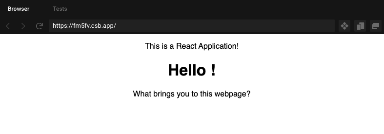

# Let's learn React
Now that we've (hopefully) convinced you that React is a powerful tool for creating applications, let's dive into the nitty gritty of React.

## Anatomy of React
[TODO] Sam + Chase
## React Functional Components
Woah, that looks like a real alphabet soup: `React Functional Components.` It turns out, it's just another example of Computer Scientists making names sound more complicated than they need to be. Don't worry if it doesn't make sense right now, let's dissect it piece by piece.

### A brief review of functions
Let's first analyze `Functional Components` What does this mean? In an English sentence, we can say that
> The components that make up our application will be written as Javascript functions

Let's review Javascript functions briefly, and see why we choose to represent our web application components in this way.
```js
function calc_num_cookies(input){
  let output = 0;
  output = (input * 8) - 17;
  if(output < 0) output = output * -1;
  output = Math.floor(output / 2) % 26;
  output = output + " chocolate chip cookies";
  return output;
}
```
This function, `calc_num_cookies()` takes a number as an `input`, and returns some number of cookies as an `output`. The inside of the function holds our implementation and there's a lot of complex math going on.

But remember that's exactly what makes functions so powerful. As a user, we don't care about the complex math that's going on behind the scenes. We only care that the function works as expected when we call it:
```js
calc_num_cookies(999)
"23 chocolate chip cookies"

calc_num_cookies(0.22)
"7 chocolate chip cookies"
```
React chooses to use functions to implement components exactly becauses **functions encapsulate complexity**, or in other words, functions hide implementations that we might not care about.

Recall how the Anatomy of React is made up of components, so putting all this information together we can say that
> The components that create the Anatomy of our React application will be written as Javascript functions.

### Creating Functional Components
Let's actually look at how we would write a Functional Component in React.
```jsx
function Hello(){
  return (
    <div>
      <h1>Hello Evan!</h1>
    </div>
  );
}
```
Here we've defined a functional component called `Hello` that takes no input and returns a bit of `HTML`.

That might seem odd, but think back to what `HTML` does: create the structure of a webpage. With that in mind, for React Functional Components to actually be useful, they have to return `HTML` as the building blocks to make our application.

What if we wanted to use our `Hello` component we just created?
```jsx
<div className="App">
  <p>
    This is a React Application!
  </p>
  <Hello/>
  <p>
    What brings you to this webpage?
  </p>
</div>
```
As shown above, we can simply use `<Hello/>` as if it were any other `HTML` tag. Neat!

But you may have noticed an issue with our Functional Component, it only displays one name! The world is complex, with a whole assortment of names, so our component must be able to adapt to all that complexity.
```jsx
function Hello(props){
  return (
    <div>
      <h1>Hello {props.name}!</h1>
    </div>
  );
}
```
Here we introduce `props` (short for properties) which is an input to our `Hello` functional component. You can think of `props` as a JavaScript object that holds all the information that makes our functional component work. In this case, our `props` object contains the variable `name`

We can edit our `<Hello/>` tag to now take an attribute called `name`. Note how it's spelled exactly the same and in the same case as our new property.
```jsx
<div className="App">
  <p>
    This is a React Application!
  </p>
  <Hello name={"Sam"}/>
  <p>
    What brings you to this webpage?
  </p>
</div>
```
Let's finally extend our `Hello` component to implement some logic. What is we don't know someone's name? Currently our website looks like this:

Not a good user experience! 

We should edit our component like so
```jsx
function Hello(props){
  let user_name = props.name
  if (!user_name){
    user_name = "Stranger"
  }
  return (
    <div>
      <h1>Hello {user_name}!</h1>
    </div>
  );
}
```
Note how we've created a *variable* `user_name` to hold the property `props.name`. If `user_name` doesn't contain a name (i.e. contains nothing) then we'll set it to the string `"Stranger"`, allowing for a much cleaner user interface!


## The big picture
So what have we learned?

[TODO] Sam + Chase about anatomy

The anatomy of React is comprised of components, and we've learned how to write React Functional Components.

We're using functions to *encapsulate complexity* and hide complex implementations of the behavior we want out of our components. Instead of having to write the blob of code:
```jsx
let user_name = props.name
if (!user_name){
  user_name = "Stranger"
}
return (
  <div>
    <h1>Hello {user_name}!</h1>
  </div>
);
```
everytime we need to display a hello message, we can simply just use
```jsx
<Hello name={"Chase"} />
<Hello name={"Alice"} />
<Hello name={"Sam"} />
<Hello name={""} />
```
Our code is more compact, it's easier to read, and it can *React* to the dynmiac world (pun intended). For our `Hello` component, it will change what is displayed on our application based on the `props.name` input it receives.
